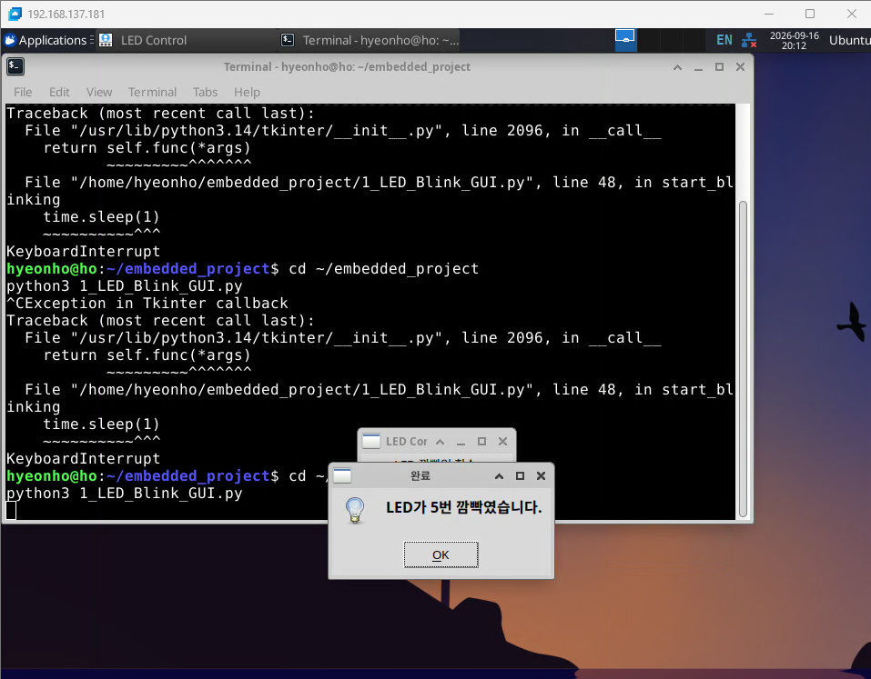
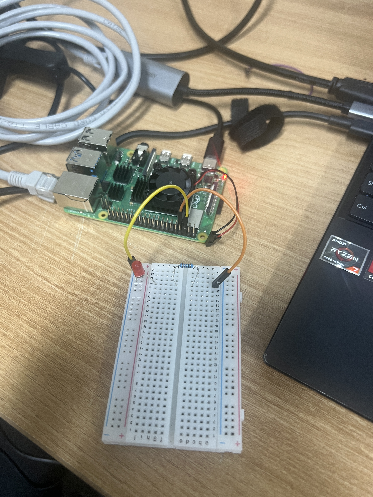
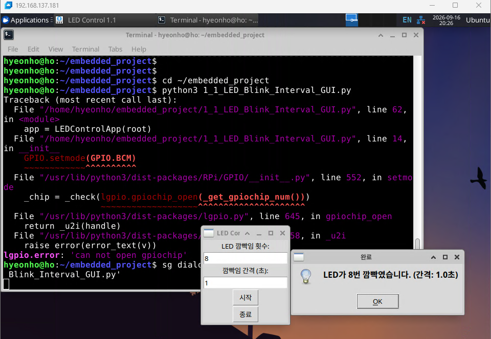
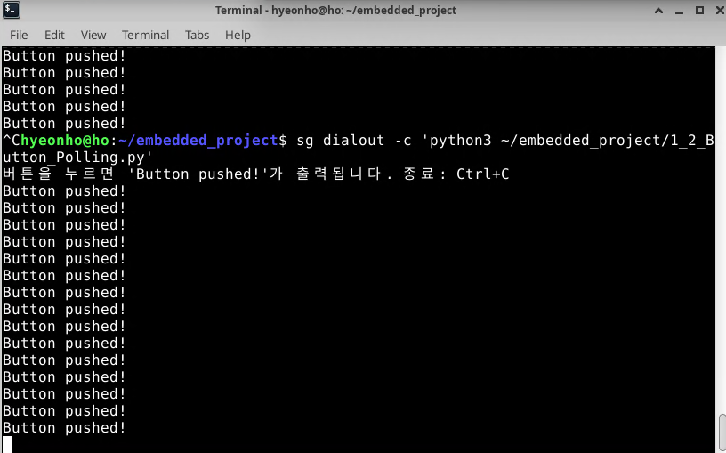
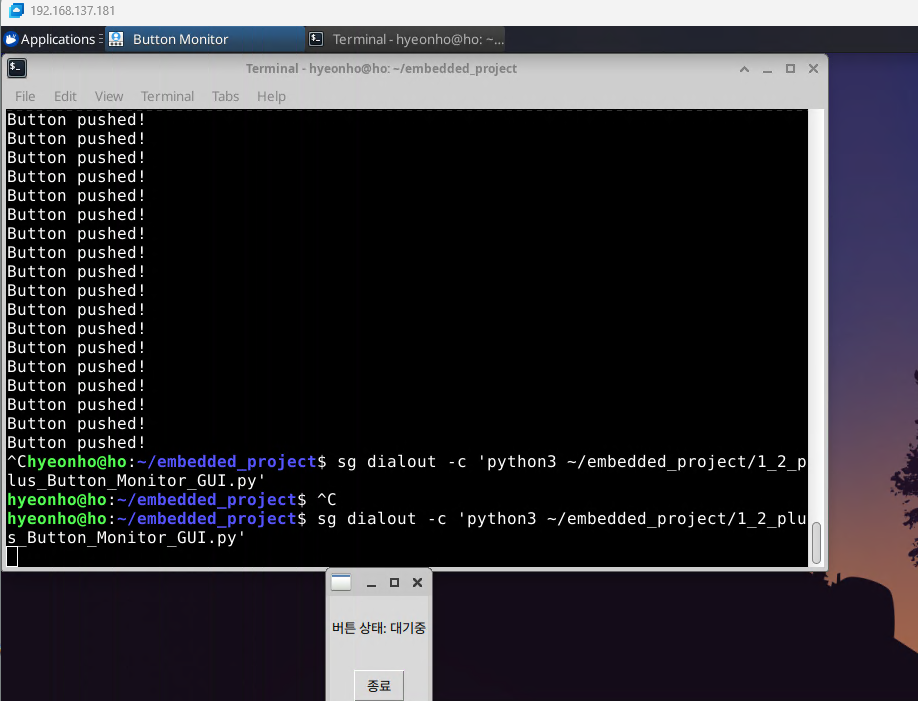
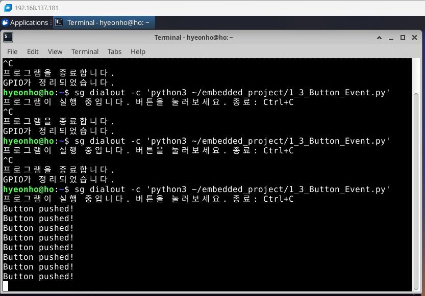
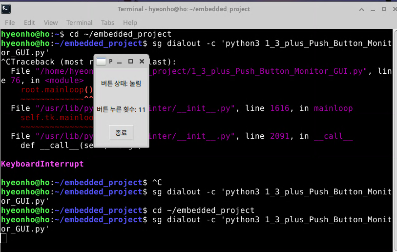

# Level 1 실습 사진

## 1. LED 점멸 GUI

| 화면 | 기록 |
| --- | --- |
| 입력 화면 |  |
| 5회 점멸 완료 |  |
| 브레드보드 배선 |  |

## 1-1. 점멸 간격 GUI

| 화면 | 기록 |
| --- | --- |
| 횟수·간격 입력 |  |
| 8회, 1초 간격 완료 |  |

## 1-2. 버튼 Polling과 상태 GUI

| 화면 | 기록 |
| --- | --- |
| Polling 출력 |  |
| 브레드보드 배선 |  |
| GUI 대기 상태 |  |
| GUI 눌림 상태 |  |
| GUI 떼어짐 상태 |  |

## 1-3. 버튼 Event와 횟수 GUI

| 화면 | 기록 |
| --- | --- |
| Rising event 출력 |  |
| GUI 누른 횟수 9회 |  |
| GUI 누른 횟수 11회 |  |
