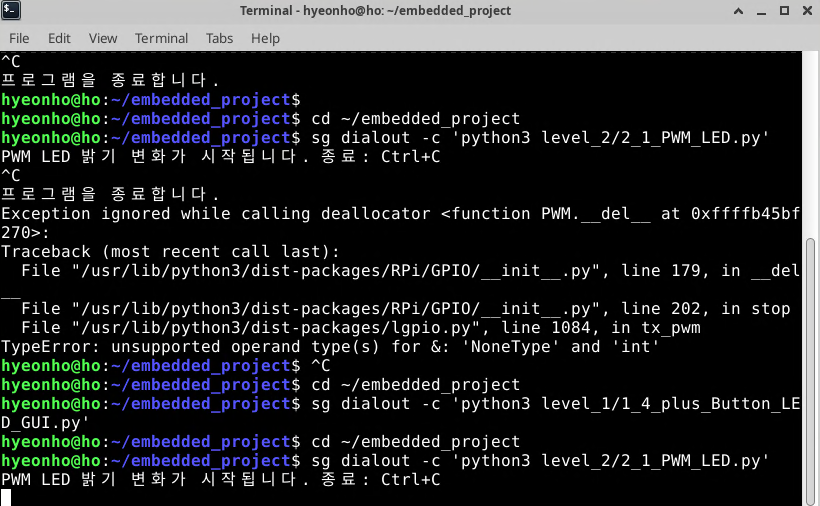
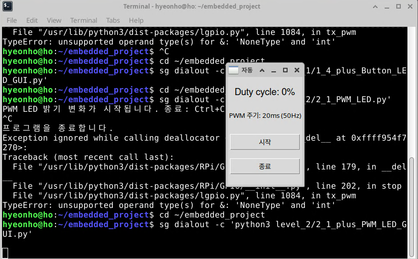
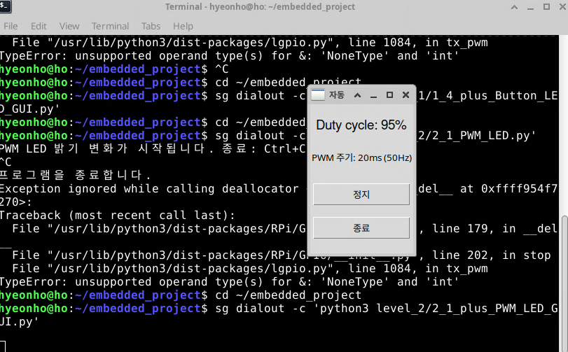
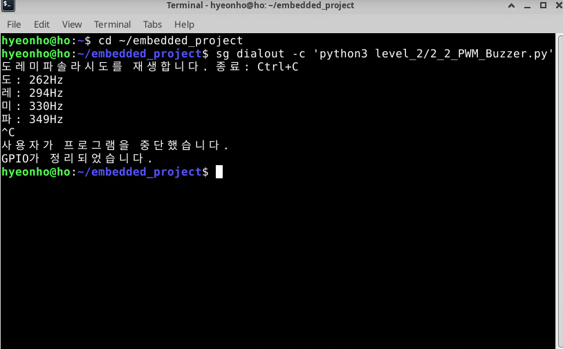
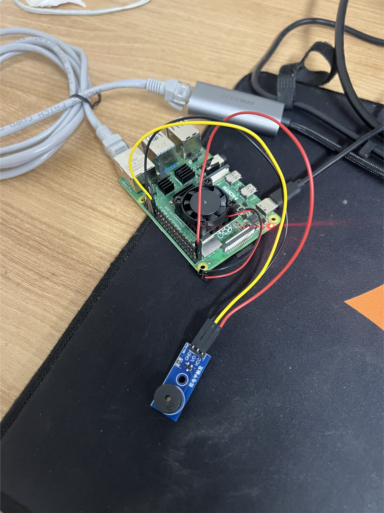
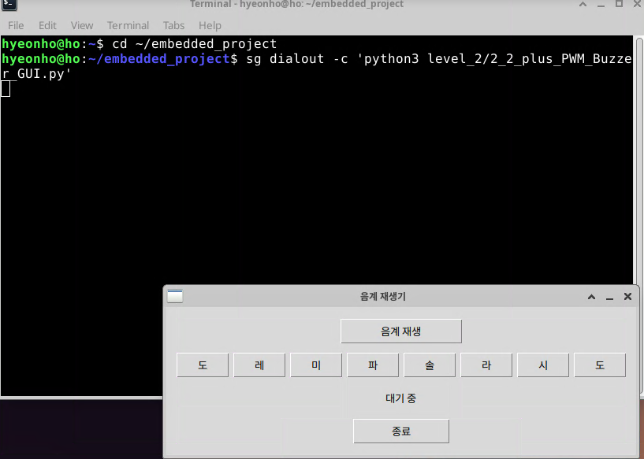

# Level 2 실습 사진·영상

## 2-1. PWM LED 밝기 변화

| 기록 | 파일 |
| --- | --- |
| 터미널 실행 |  |
| LED 밝기 변화 | [MP4 영상 보기](2-1/02_pwm_led_brightness.mp4) |

## 2-1+. PWM LED GUI

| 기록 | 파일 |
| --- | --- |
| 실행 전 |  |
| 95% Duty cycle 재생 |  |

## 2-2. PWM 부저 음계 재생

| 기록 | 파일 |
| --- | --- |
| 도·레·미·파 재생 터미널 |  |
| 부저 모듈 배선 |  |

## 2-2+. PWM 부저 GUI

| 기록 | 파일 |
| --- | --- |
| 음계·개별 음 재생 화면 |  |
